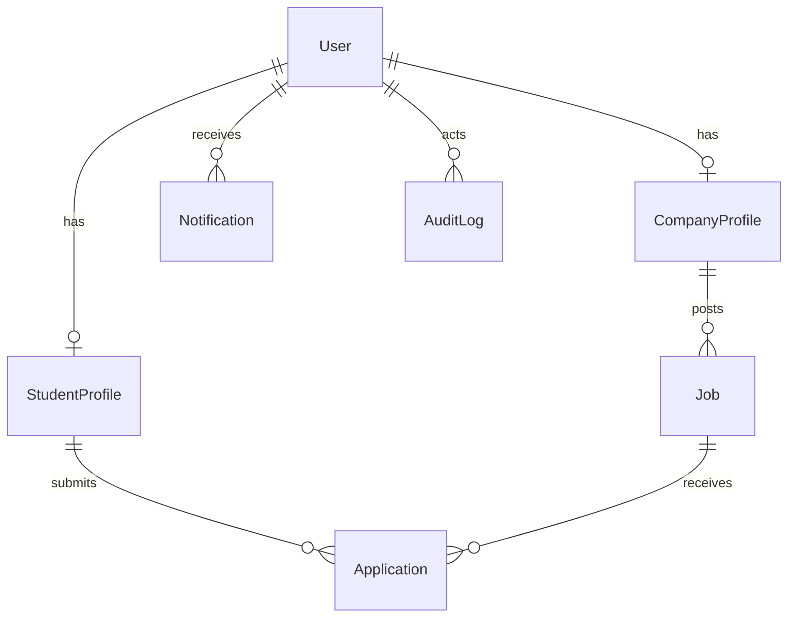

# Campus Recruitment Platform - Full Project Documentation

Last updated: March 14, 2026

This is the complete technical and functional documentation for the **Campus Recruitment Platform** monorepo (`campus-saved-2026-02-26`).

---

## 1) Project Overview

### 1.1 Problem Statement
Traditional campus/job portals usually require:
- Manual CV screening.
- Manual shortlist and interview scheduling.
- Repeated back-and-forth communication for interview slots.
- Weak eligibility transparency for candidates.

This project solves that by introducing **rule-based eligibility**, **automatic interview slot assignment**, and **deadline-based finalization**, while still allowing company override controls.

### 1.2 Core Goal
Build a platform where:
- Companies post jobs with flexible/compulsory requirements.
- Students see eligibility and apply only when they pass compulsory rules.
- System ranks applications and automatically allocates interview slots.
- Jobs auto-close after deadline finalization.

### 1.3 User Roles
- `STUDENT`
- `COMPANY`
- `ADMIN`

---

## 2) Monorepo Structure

- `Campusrec.io/` -> Frontend (React + Vite + Tailwind)
- `Campus-back/` -> Backend (Node.js + Express + Prisma + PostgreSQL)
- `docs/` -> Deployment and operations docs
- `scripts/` -> Startup automation (`start-all.sh`)
- `.github/` -> CI workflow and Dependabot automation

---

## 3) Tech Stack

### Frontend
- React 19
- React Router 7
- Axios
- Tailwind CSS
- React Toastify

### Backend
- Node.js (ESM)
- Express 4
- Prisma ORM 5
- PostgreSQL
- Zod validation
- JWT auth
- Multer file upload
- Cloudinary (or local uploads fallback)
- Nodemailer

### DevOps / Quality
- Node built-in test runner (`node --test`)
- Supertest for API validation tests
- Prettier
- GitHub Actions CI
- Dependabot

---

## 4) Architecture

### 4.1 High-Level Design
1. Frontend calls backend REST APIs using JWT in `Authorization: Bearer`.
2. Backend validates request via Zod and middleware.
3. Prisma persists/retrieves data from PostgreSQL.
4. Eligibility engine computes pass/fail + match details.
5. Scheduler service assigns interview slots and finalizes jobs after deadlines.
6. Notification service sends in-app notifications and optional email.

### 4.2 Backend Entry Points
- `Campus-back/src/server.js` -> server boot + DB connect + deadline worker.
- `Campus-back/src/app.js` -> middleware, CORS, rate limits, route mounting.

### 4.3 Frontend Entry Points
- `Campusrec.io/src/main.jsx` -> providers (`Theme`, `Toast`, `Auth`) + router.
- `Campusrec.io/src/App.jsx` -> role-protected route map.

---

## 5) Main Features

### 5.1 Student
- View jobs with eligibility insights (`ELIGIBLE`, `NEAR_MATCH`, `NOT_ELIGIBLE`).
- See compulsory/flexible requirement breakdown.
- Apply only if eligible.
- CV required during application (upload or saved profile resume).
- View applications, interview date/start time/queue, and notifications.
- Manage profile with resume, skills, degree, age, experience, links.

### 5.2 Company
- Create/edit/delete jobs.
- Configure interview schedule:
  - Application deadline
  - Interview dates
  - Interview start time
  - Candidates per day
- Build advanced requirement groups:
  - Rule type: `MANDATORY` or `FLEXIBLE`
  - Match type: `ANY` (OR) or `ALL` (AND)
  - Category-based skill builder
- Review applicants in pipeline.
- Assign/reschedule interview manually (override supported).
- Retry status emails if delivery fails.

### 5.3 Admin
- Dashboard metrics (users, jobs, applications, approved).
- Manage users (role/status update, single delete, bulk delete).
- Manage jobs (delete).
- Create company accounts.
- Audit logs.
- Platform eligibility settings (global flexible threshold).

---

## 6) Frontend Route Map

Public:
- `/login`
- `/register`
- `/terms`
- `/privacy`
- `/companies/:id`

Student:
- `/student`
- `/student/jobs`
- `/student/profile`
- `/student/applications`

Company:
- `/company`
- `/company/applications`
- `/company/profile`

Admin:
- `/admin`
- `/admin/profile`

---

## 7) Backend API Map

Base URL: `http://localhost:3005/api`

### Auth (`/auth`)
- `POST /register`
- `POST /login`
- `GET /me`
- `PUT /update`

### Student (`/student`)
- `GET /profile`
- `PUT /profile` (multipart)

### Company Profiles (`/companies`)
- `GET /me/profile`
- `PUT /me/profile` (multipart)
- `GET /:id` (public)

### Jobs (`/jobs`)
- `GET /` (public open jobs)
- `GET /eligible` (student eligibility listing)
- `GET /company` (company jobs)
- `GET /:id` (job details)
- `POST /` (create job)
- `PUT /:id` (update own job)
- `DELETE /:id` (delete own job)

### Applications (`/applications`)
- `POST /jobs/:jobId/apply`
- `GET /me` (student)
- `GET /company` (company)
- `POST /:id/manual-assign`
- `PATCH /:id` (status update)
- `POST /:id/retry-email`

### Notifications (`/notifications`)
- `GET /me`
- `PATCH /:id/read`
- `POST /read-all`

### Upload (`/upload`)
- `POST /resume`
- `POST /file`

### Admin (`/admin`)
- `GET /stats`
- `GET /settings`
- `PUT /settings/eligibility`
- `GET /users`
- `PATCH /users/:id`
- `POST /users/bulk-delete`
- `DELETE /users/:id`
- `GET /jobs`
- `DELETE /jobs/:id`
- `GET /audit-logs`
- `POST /companies`

### Health
- `GET /health`

---

## 8) Database Design (Prisma / PostgreSQL)

Source: `Campus-back/prisma/schema.prisma`

### 8.1 Enums
- `Role`: `ADMIN`, `STUDENT`, `COMPANY`
- `JobType`: `FULL_TIME`, `PART_TIME`, `INTERNSHIP`, `CONTRACT`
- `ApplicationStatus`: `PENDING`, `INTERVIEW`, `ACCEPTED`, `REJECTED`, `APPROVED`

### 8.2 Tables and Key Fields

#### `User`
- `id` (PK)
- `email` (unique)
- `password`
- `name`
- `role`
- `isActive`
- `createdAt`, `updatedAt`

#### `StudentProfile`
- `id` (PK)
- `userId` (unique, FK -> User)
- `resumeUrl`, `phone`, `location`
- `education`, `degree`, `age`
- `skills` (text array)
- `bio`, `linkedin`, `github`, `website`
- `experience`, `experienceYears`
- `profileImageUrl`

#### `CompanyProfile`
- `id` (PK)
- `userId` (unique, FK -> User)
- `name`
- `website`, `location`, `contactPhone`, `about`, `imageUrl`

#### `Job`
- `id` (PK)
- `title`, `description`, `location`, `type`
- `mandatorySkills` (array)
- `requiredSkills` (array)
- `requirementGroups` (JSON)
- `flexibleMatchThreshold`
- `requiredDegree`, `minAge`, `maxAge`, `minExperienceYears`
- `applicationDeadline`
- `isClosed`, `closedAt`, `autoFinalizedAt`
- `interviewDates` (date array)
- `interviewStartTime`
- `interviewCandidatesPerDay`
- `companyId` (FK -> CompanyProfile)
- `createdAt`

#### `Application`
- `id` (PK)
- `jobId` (FK -> Job)
- `studentId` (FK -> StudentProfile)
- `status`
- `matchScore`
- `matchSummary` (JSON)
- `interviewDate`, `interviewStartTime`, `interviewQueueNumber`, `interviewNote`
- `manualInterviewOverride`
- `createdAt`
- Unique: `(jobId, studentId)`

#### `AuditLog`
- `id` (PK)
- `actorId` (nullable FK -> User)
- `action`, `entityType`, `entityId`
- `metadata` (JSON)
- `createdAt`

#### `Notification`
- `id` (PK)
- `userId` (FK -> User)
- `type`, `title`, `message`
- `metadata` (JSON)
- `readAt`, `createdAt`

#### `PlatformSetting`
- `key` (PK)
- `valueInt`, `valueJson`
- `createdAt`, `updatedAt`

### 8.3 Relationship Summary
- One `User` can have one `StudentProfile` or one `CompanyProfile`.
- One `CompanyProfile` has many `Job`.
- One `StudentProfile` has many `Application`.
- One `Job` has many `Application`.
- Notifications belong to users.
- Audit logs optionally reference an actor user.

### 8.4 ER Diagram (Conceptual)



---

## 9) Eligibility Engine (Rule-Based)

Source: `Campus-back/src/utils/eligibility.js`

### 9.1 Requirement Model
The engine supports two models:
1. **Advanced** `requirementGroups` JSON (preferred)
2. **Legacy** `mandatorySkills` + `requiredSkills` arrays (auto-converted)

### 9.2 Rules
- `MANDATORY` groups are hard blockers.
- `FLEXIBLE` groups contribute to match percentage and ranking.
- `matchType: ANY` -> at least one skill in group.
- `matchType: ALL` -> all skills in group required.

### 9.3 Skill Matching Sources
A skill is considered matched if found in:
- Student profile skills OR
- Parsed resume text

### 9.4 Additional Hard Checks
If configured by company:
- Degree
- Min/max age
- Min experience years

### 9.5 Resume Quality Checks
When enforced:
- Empty/unreadable CV without profile signal can block eligibility.
- Very short or poor-structure CV produces advisories/reasons.
- Contact details and section structure are checked heuristically.

### 9.6 Eligibility Output
Returns:
- `eligible` boolean
- `nearMatch` boolean
- `tier` (`ELIGIBLE` / `NEAR_MATCH` / `NOT_ELIGIBLE`)
- `reasons`, `advisories`
- `matchedSkills`, `missingSkills`
- `flexibleMatchPercent`, threshold used
- `score` (0-100)
- rich `details` for UI explanation

### 9.7 Scoring (High-Level)
Score combines:
- Group match coverage
- Experience contribution
- Degree contribution
- Age contribution (if applicable)
- Resume evidence contribution

---

## 10) Interview Scheduling Automation

Source: `Campus-back/src/services/interviewScheduler.js`

### 10.1 Scheduling Inputs Per Job
- `applicationDeadline`
- `interviewDates[]`
- `interviewStartTime` (`HH:mm`)
- `interviewCandidatesPerDay`

### 10.2 Ranking Rule for Slot Assignment
At finalization time, eligible applications are sorted by:
1. Higher `flexibleMatchPercent`
2. Earlier application `createdAt`
3. Lower application `id` (stable tie-break)

### 10.3 Slot Allocation
- Fill date slots in configured order.
- Queue number increments within each date.
- Assigned applications become `INTERVIEW`.
- Eligible candidates beyond capacity become `REJECTED` with reason.

### 10.4 Deadline Finalization Worker
- Background worker starts with backend.
- Runs every ~60 seconds.
- Finds due jobs (`applicationDeadline <= now`, not already closed).
- Finalizes assignments and closes job:
  - `isClosed = true`
  - `closedAt = now`
  - `autoFinalizedAt = now`

### 10.5 Manual Override
Company can manually assign/reschedule interview:
- Sets `manualInterviewOverride = true`
- Preserved as locked interview in recompute/finalization

### 10.6 Notifications
On assignment/rejection:
- In-app `Notification` record
- Email send attempt when email env is configured

---

## 11) Application Lifecycle

1. Job posted with requirements + schedule + deadline.
2. Student sees match evaluation in jobs list.
3. Student can apply only if eligible (compulsory pass + threshold pass).
4. Application stored as `PENDING` with match summary snapshot.
5. Company may manually assign interview/status updates.
6. At deadline, auto-finalizer ranks and assigns interview slots.
7. Overflow eligible applications are rejected due to full slots.
8. Job auto-closes after finalization.

---

## 12) Security, Validation, and Reliability

### 12.1 Auth and Authorization
- JWT-based authentication.
- Role guards (`authorize`) on protected routes.
- Suspended users (`isActive=false`) are blocked.

### 12.2 Validation
- Zod request validation on body/query/params.
- Job payload validation for schedule and logical constraints.
- `minAge <= maxAge` enforced.
- Interview dates must be on/after deadline.

### 12.3 API Protection
- Helmet security headers.
- CORS allowlist + Vercel and LAN patterns.
- Rate limits for `/api`, `/api/auth`, `/api/upload`.
- Request ID tracing with structured logging.

### 12.4 Upload Safety
- 10 MB file limit.
- MIME filters.
- Cloudinary upload with local fallback if Cloudinary not configured.

---

## 13) Automation and Ops

### 13.1 Local Startup
Run from monorepo root:

```bash
npm run start:all
```

Script behavior (`scripts/start-all.sh`):
- Verifies ports `3005` and `5173` are free.
- Installs dependencies if missing.
- Runs Prisma generate + migrate deploy.
- Starts backend and frontend together.

### 13.2 CI (GitHub Actions)
Workflow: `.github/workflows/ci.yml`
- Backend: install, lint, format-check, test.
- Frontend: install, lint, format-check, build.

### 13.3 Dependency Automation
`.github/dependabot.yml` updates:
- Backend npm weekly
- Frontend npm weekly
- GitHub Actions weekly

---

## 14) Environment Configuration

### Backend (`Campus-back/.env`)
Required:
- `DATABASE_URL`
- `JWT_SECRET`
- `PORT`
- `API_URL`
- `FRONTEND_URL`

Optional:
- `DISABLE_RATE_LIMIT`
- `LOG_LEVEL`
- `CLOUDINARY_*`
- `EMAIL_USER`, `EMAIL_PASSWORD`, `EMAIL_FROM`

### Frontend (`Campusrec.io/.env`)
- `VITE_API_URL=http://localhost:3005/api`

---

## 15) Testing Coverage

Backend tests include:
- `app.validation.test.js`
  - health endpoint
  - payload validation
  - unauthenticated access checks
- `eligibility.rules.test.js`
  - hard requirements
  - mandatory/flexible behavior
  - one-of alternatives
  - advanced group matching (ANY/ALL)
  - resume quality gating
  - threshold behavior

Run:

```bash
cd Campus-back
npm test
```

---

## 16) UI/UX Design System Notes

Frontend uses CSS variable tokens and dual theme support (`light`/`dark`) in `Campusrec.io/src/index.css`.

Key design foundations:
- Tokenized surfaces (`--surface-card`, `--surface-panel`, etc.)
- Tokenized text colors (`--text-strong`, `--text-muted`, `--text-soft`)
- Theme classes: `html.theme-light`, `html.theme-dark`
- Shared reusable classes: `section-shell`, `surface-card`, `input-field`, `btn-brand`, etc.

This keeps readability stable across both light and dark modes.

---

## 17) Screenshots

These screenshots are included for interview/demo use:

### Student Job Discovery and Eligibility UI


### Student Job Card and Requirement Check UI


---

## 18) Interview Demo Script (Recommended)

1. Login as company and create a job with:
   - Mandatory and flexible groups
   - Deadline
   - Interview dates, start time, candidates/day
2. Login as student and complete profile + resume.
3. Open Jobs page and show eligibility explanation per job.
4. Apply to eligible role.
5. Show company applications pipeline.
6. Trigger manual interview assignment (optional).
7. Explain automatic finalization behavior after deadline.
8. Show student notifications/application tracking page.
9. Show admin panel metrics and audit logs.

---

## 19) Current Strengths

- Transparent, explainable eligibility (not black-box).
- Strong separation of compulsory vs flexible requirements.
- Supports alternatives (`A/B/C`) and group logic (`ANY/ALL`).
- Automated interview assignment and deadline closure.
- In-app + email communication support.
- Admin governance + audit logs.
- Monorepo CI and dependency automation.

---

## 20) Known Improvement Opportunities

- More deterministic resume parsing pipeline (structured extraction per section).
- Better test coverage for scheduler edge cases and manual override conflicts.
- Retry queue/outbox for guaranteed email delivery.
- Calendar integration (Google/Outlook) for interview invites.
- Webhooks for external ATS sync.

---

## 21) Quick Commands Reference

From monorepo root:

```bash
npm run start:all
npm run check:all
```

Backend only:

```bash
cd Campus-back
npm run dev
npm run lint
npm run format:check
npm test
npx prisma migrate deploy
```

Frontend only:

```bash
cd Campusrec.io
npm run dev
npm run lint
npm run format:check
npm run build
```

---

## 22) File References (Primary)

- Backend app bootstrap: `Campus-back/src/app.js`
- Backend scheduler: `Campus-back/src/services/interviewScheduler.js`
- Eligibility engine: `Campus-back/src/utils/eligibility.js`
- Job routes: `Campus-back/src/routes/jobs.js`
- Application routes: `Campus-back/src/routes/applications.js`
- Prisma schema: `Campus-back/prisma/schema.prisma`
- Frontend route map: `Campusrec.io/src/App.jsx`
- Student jobs UI: `Campusrec.io/src/pages/student/Jobs.jsx`
- Company dashboard UI: `Campusrec.io/src/pages/company/Dashboard.jsx`
- Company job form: `Campusrec.io/src/components/company/dashboard/JobFormPanel.jsx`
- Admin overview: `Campusrec.io/src/pages/admin/Overview.jsx`

---

This document is intended to be your **single interview-ready master document** for this project.
